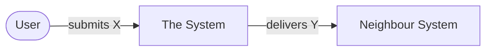
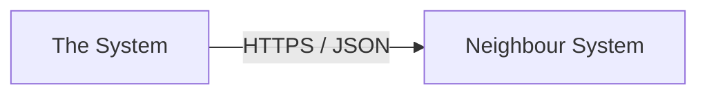

# 3. Context and scope

_Last reviewed: {{DATE}}_

<!-- The black-box view: what is inside, what is outside, and what crosses the line. No internals. -->

## 3.1 Business context

<!-- Actors and neighbour systems with the value they exchange, in domain language. A domain expert
     should be able to read this diagram without asking about protocols. -->

| Neighbour / actor | Responsibility | Direction | Exchanged |
| ----------------- | -------------- | --------- | --------- |
|                   |                |           |           |

> **TODO:**

## 3.2 Technical context

<!-- The same edges as integrations: protocol, format, direction, ownership, authentication.
     Not everything is REST — files, SFTP, e-mail, exports and manual uploads are integrations too. -->

| Interface | Direction | Protocol / format | Authentication | Owner | Specification |
| --------- | --------- | ----------------- | -------------- | ----- | ------------- |
|           |           |                   |                |       |               |

> **TODO:**

### Example payloads

<!-- For the 1–3 most important interfaces. A concrete example beats a paragraph of abstraction. -->

> **TODO:**
