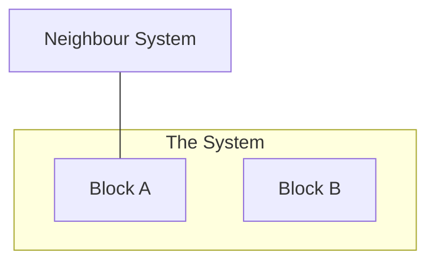

# 5. Building block view

_Last reviewed: {{DATE}}_

<!-- The static structure, coarse first. Every block gets one sentence of responsibility.
     No flows (chapter 6), no environments (chapter 7), no full interface specs — link them. -->

## 5.1 Level 1 — the system as a white box

<!-- Must contain the system boundary and the neighbours from chapter 3, or the two chapters
     describe different systems. -->

| Block | Responsibility | Depends on | Interfaces | Code |
| ----- | -------------- | ---------- | ---------- | ---- |
|       |                |            |            |      |

> **TODO:**

## 5.2 Level 2

<!-- Only for the blocks that are complex or risky. Stop when more detail stops answering a real
     question. Name responsibilities, not technologies — "Redis" is not a responsibility. -->

> **TODO:** or delete this section until a block earns it.

## Data ownership

<!-- Who may write which data, and who may only read it. Left unsaid, it is guessed wrongly. -->

> **TODO:**
