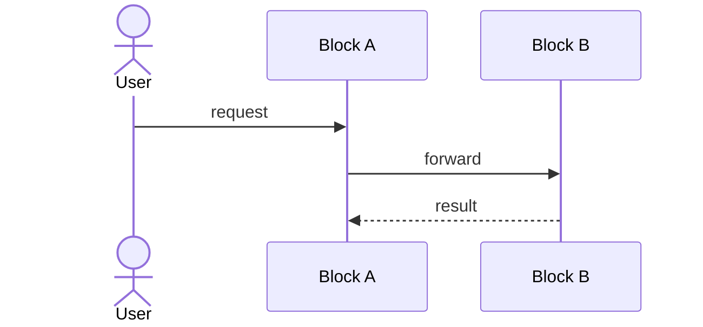

# 6. Runtime view

_Last reviewed: {{DATE}}_

<!-- One to three scenarios that reveal something about the architecture — usually the ones that
     cross the system boundary. Participant names must match chapter 5. Cross-cutting flows
     (auth, logging, error handling) belong in chapter 8 and get linked, not retold here. -->

## 6.1 {{ TODO: scenario name }}

**Intention:** why this scenario is documented — what it reveals.

**Participants:** the blocks from chapter 5 involved.

<!-- Show transformations and decisions. Skip routine returns and unchanged payloads. -->

**Happy path:** the steps in prose, only where the diagram is not self-explanatory.

**Exceptions:** what happens on timeout, failure or duplicate — retries, idempotency, compensation,
degraded behaviour. This is where the architecture actually lives; a scenario with only a happy path
documents the easy half.

**Observability:** correlation IDs, consistency expectations, what an operator sees when this fails.

> **TODO:** repeat per scenario.
