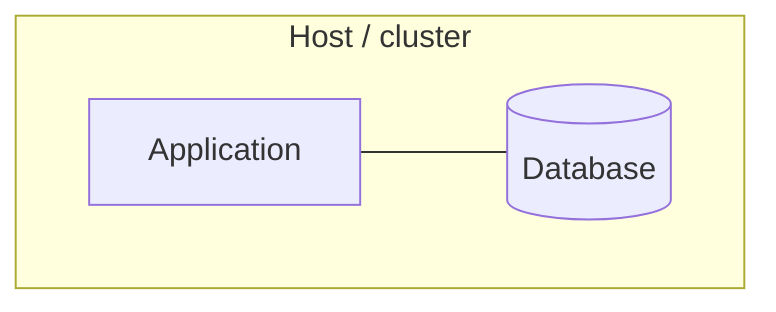

# 7. Deployment view

_Last reviewed: {{DATE}}_

<!-- Where things run and what must be configured. Document development and test environments too —
     that is where most of the confusion actually is. Never write a secret's value. -->

## 7.1 Infrastructure level 1

**Motivation:** why this topology — which quality goal or constraint it serves.

**Quality and performance:** the throughput, latency and availability this setup is meant to deliver.

> **TODO:**

## 7.2 Mapping of building blocks to infrastructure

| Building block | Node / environment | Notes |
| -------------- | ------------------ | ----- |
|                |                    |       |

> **TODO:**

## 7.3 Environments

| Environment | Purpose | Where | Differences from production |
| ----------- | ------- | ----- | --------------------------- |
| production  |         |       | —                           |
|             |         |       |                             |

## 7.4 Configuration

<!-- The practical question this answers: what do I need to configure to make this run? -->

| Setting | Where set | Default | Required | Effect |
| ------- | --------- | ------- | -------- | ------ |
|         |           |         |          |        |

**Secrets:** name them and say where they come from. Never record a value.

## 7.5 Operations

> **TODO:** scaling, backups and restore, failure behaviour, trust boundaries, data classification,
> and links to the infrastructure-as-code that creates all of this.
