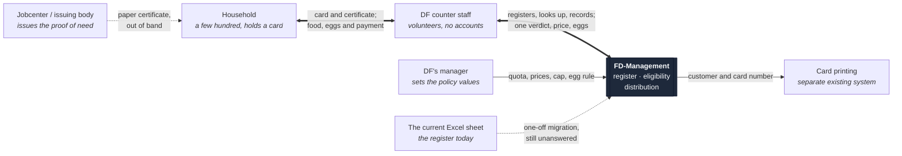
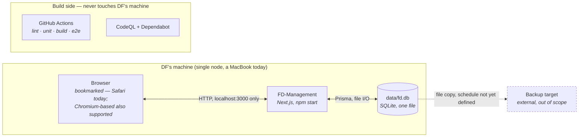

# 3. Context and scope

_Last reviewed: 2026-08-29_

The system's edges are unusually thin, and that is a design outcome rather than an accident: it runs
on one machine, talks to no service, and every exchange with the world outside it happens on paper or
by hand. Everything in this chapter treats FD-Management as a black box; the lid comes off in
[chapter 5](05-building-block-view.md).

## Business context

**Reading it:** nothing crosses the system boundary electronically. The certificate arrives as a
piece of paper a staff member reads and types in. The card is printed elsewhere from numbers this
system derives. The only continuous exchange is between a staff member and the screen.

## Technical context

**There is no other listener, no outbound call, and no scheduled process.** The application makes no
network request at runtime — the font is self-hosted precisely so a day without internet is a normal
day.

## Neighbours

| Neighbour                            | Responsibility                                                    | Direction                           | Exchanged                                                                            | Format / protocol                  | Owner                                                                             |
| ------------------------------------ | ----------------------------------------------------------------- | ----------------------------------- | ------------------------------------------------------------------------------------ | ---------------------------------- | --------------------------------------------------------------------------------- |
| Counter staff                        | Operate the system; make every judgement call it declines to make | Both                                | Registrations, lookups, hand-outs, reminders, renewals; verdicts, prices, egg counts | HTML over HTTP on `localhost:3000` | DF                                                                                |
| DF's manager                         | Set the policy values                                             | Inbound                             | Quota, prices per head, price cap, distribution weekday, week anchor, egg rule       | The `/einstellungen` screen        | DF                                                                                |
| Household (customer)                 | Present a card; bring a valid certificate                         | Indirect — never touches the system | Card number, proof of need                                                           | Spoken and on paper                | —                                                                                 |
| Jobcenter / issuing body             | Issue the proof of need                                           | Out of band                         | Certificate type and validity date, typed in by staff                                | Paper                              | External                                                                          |
| Card printing system                 | Print the physical cards                                          | Outbound, manual                    | Customer number and card number, read off `/kunden/[id]/karte`                       | Read from screen                   | DF (existing system)                                                              |
| `data/fd.db`                         | Hold the entire register                                          | Both                                | Everything                                                                           | SQLite file on the local disk      | DF                                                                                |
| Backup target                        | Hold a restorable copy of the register                            | Outbound                            | A copy of `data/fd.db`                                                               | File copy plus a WAL checkpoint    | DF — **no schedule exists yet**, see [chapter 11](11-risks-and-technical-debt.md) |
| The current Excel sheet              | The register as it is kept today                                  | Inbound, one-off                    | A few hundred households                                                             | Undecided                          | DF — **migration route still unanswered**                                         |
| GitHub Actions / CodeQL / Dependabot | Gate every change before it lands                                 | Build side only                     | Source, test results, advisories                                                     | GitHub                             | The maintainer                                                                    |

## Explicitly not neighbours

No cloud service, no hosted database, no authentication provider, no e-mail or SMS gateway, no
payment processor, no analytics, no CDN, no printer driver. Payment happens in cash at the counter;
the system records the **amount** handed over and derives one balance per household from it, and
nothing about that money leaves the machine.

---

Previous: [2. Architecture constraints](02-architecture-constraints.md) · Next: [4. Solution strategy](04-solution-strategy.md)
