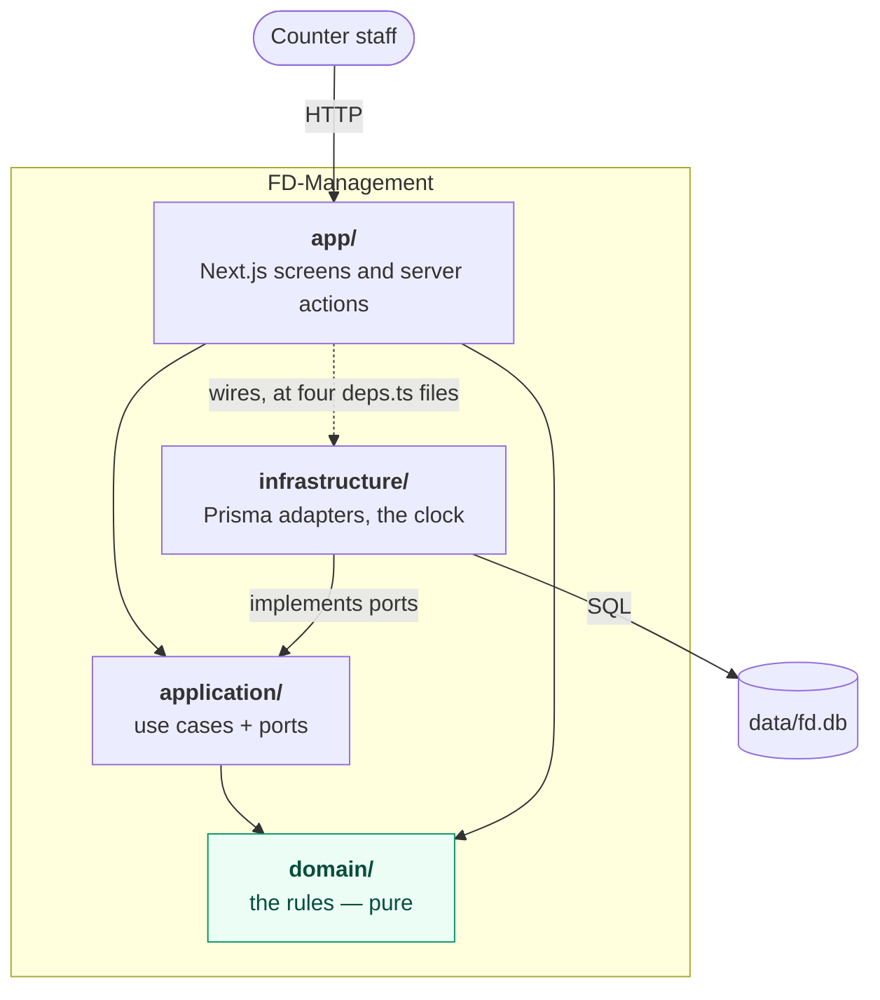

# 5. Building block view

_Last reviewed: 2026-09-20_

Deliberately terse. One sentence of responsibility per block, no function listings — the code and its
tests are the reference for those, and a second copy here is the one that would go stale.

## Level 1 — the four layers

Arrows are _depends on_. Nothing points outward — that is the whole rule, and
[ESLint enforces it](adr/001-layer-the-system-hexagonal-lite-and-enforce-the-boundary-in-the-build.md).

| Block                 | Responsibility                                                                                | Depends on              | May do I/O?                       |
| --------------------- | --------------------------------------------------------------------------------------------- | ----------------------- | --------------------------------- |
| `src/domain/`         | Owns every business rule as pure functions and value objects, and the typed errors they throw | nothing                 | **No** — and no wall clock either |
| `src/application/`    | Orchestrates one user intention per use case, reaching the outside only through `ports.ts`    | `domain`                | Only through ports                |
| `src/infrastructure/` | Implements the ports against Prisma, the filesystem and the system clock                      | `application`, `domain` | **Yes** — the only layer that may |
| `src/app/`            | Validates input with Zod, calls one use case, renders German                                  | `application`, `domain` | Only by calling a use case        |

Business logic in `app/` is a defect, not a style preference. So is a Prisma call anywhere else.

## Level 2 — inside each layer

### `src/domain/` — 29 modules in four families

| Directory               | Responsibility                                                                                                                                                                                                                                                                                                                                                                                                                                                                                                                                                         |
| ----------------------- | ---------------------------------------------------------------------------------------------------------------------------------------------------------------------------------------------------------------------------------------------------------------------------------------------------------------------------------------------------------------------------------------------------------------------------------------------------------------------------------------------------------------------------------------------------------------------- |
| `customer/`             | What a household is and what may happen to it: composition from birthdates, the 13-year boundary, certificate expiry and state, the three-status state machine, the group a number falls in and the balancing that recommends one (`group.ts`), the free-slot arithmetic, name folding for search, waiting-list order                                                                                                                                                                                                                                                  |
| `distribution/`         | What happens at an afternoon that took place: the session itself and the groups it serves (`session.ts`), the counter verdict and its fixed precedence, one hand-out per session, the receipt a hand-out leaves when its session is ended (`handoutReceipt.ts`), the customer balance and the amount to collect, the served/expected tally, consecutive no-shows, and week-colour alternation from a single anchor — which since [ADR-020](adr/020-the-distribution-session-not-the-calendar-is-what-a-hand-out-belongs-to.md) decides nothing and is removed in US-36 |
| `card/`                 | What a card is: the derived card number, "valid means highest index", and whether what is printed still matches the household                                                                                                                                                                                                                                                                                                                                                                                                                                          |
| `policy/`               | Settings as immutable versions, resolution at an instant, price per head with cap, the egg staircase and the count a household size yields, the diff two versions produce, and the vocabulary of Nachweis-Arten (`certificateTypes.ts`) — the one configured value that is deliberately not a version ([ADR-019](adr/019-keep-the-certificate-type-list-out-of-the-versioned-settings-history.md))                                                                                                                                                                     |
| `errors.ts`, `money.ts` | The closed set of failure modes; money as integer cents with German formatting                                                                                                                                                                                                                                                                                                                                                                                                                                                                                         |

The one module worth naming individually is `distribution/counterVerdict.ts`. It produces **exactly
one** verdict from a fixed precedence chain — `NOT_FOUND → ARCHIVED → BLOCKED → WRONG_GROUP →
OUTDATED_CARD → ALREADY_SERVED → CLEAR_TO_SERVE_CERTIFICATE_EXPIRED → CLEAR_TO_SERVE`.
Assembling that answer in JSX is the mistake the module exists to prevent.

The second is `distribution/balance.ts`. A household's balance is `Σ (paidCents − priceCents)` over
its own hand-outs and is **stored nowhere** ([ADR-015](adr/015-derive-the-customer-balance-from-the-hand-out-history-never-store-it.md));
the amount to collect today is `max(0, priceCents − balance)`, and `replayPayments` re-derives what
was asked for on each past day so the history explains itself. `balanceKind` is the one place the
sign is read, so no screen compares a balance to zero itself.

### `src/application/` — 44 use cases behind twelve ports

| Directory       | Responsibility                                                                                                                                                                                                                                                                                                                                                                                                                                                       |
| --------------- | -------------------------------------------------------------------------------------------------------------------------------------------------------------------------------------------------------------------------------------------------------------------------------------------------------------------------------------------------------------------------------------------------------------------------------------------------------------------- |
| `customers/`    | Register, propose a registration, read a record or a card, list and search the register, issue and reissue cards, list cards due for reissue, block, unblock, archive, change customer number (`change-customer-number.ts` — which is also how a household changes week) and list the numbers on offer for one (`list-number-choices.ts`), edit household, details and notes, renew a certificate, log a reminder, count no-shows, search and draft from the archive |
| `distribution/` | Start, discard, end and reopen the distribution session and read its state — ending freezes the households it served and reopening thaws them — record and correct a hand-out, answer this week's colour, read the group roster                                                                                                                                                                                                                                      |
| `settings/`     | Read the version in force, append a new one, list the history with diffs; read the configured Nachweis-Arten and replace the whole list, appending one audit entry naming what was added and removed                                                                                                                                                                                                                                                                 |
| `waiting-list/` | Add, list in arrival order, promote, register from the list, remove with a reason                                                                                                                                                                                                                                                                                                                                                                                    |
| `allowance/`    | The single seam that turns a household plus a date into the counts, the eggs and the price                                                                                                                                                                                                                                                                                                                                                                           |
| `ports.ts`      | The hexagon boundary — type-only, no runtime code                                                                                                                                                                                                                                                                                                                                                                                                                    |

Every use case is a plain function taking `(deps, input)`, where `deps` is a structural subset of the
ports. There is no DI container and no class hierarchy. Two compositions are worth knowing because
they are load-bearing: `reissueCard` **delegates to** `issueCard`, so there is exactly one path by
which a card comes into existence; and `registerFromWaitingList` registers first and removes second,
because that order is the guarantee that nobody falls off the list without becoming a customer.

#### The ports

This table _is_ the boundary between the pure core and everything else.

| Port                            | What it abstracts                                                                                                                                                                                                                                                                                                |
| ------------------------------- | ---------------------------------------------------------------------------------------------------------------------------------------------------------------------------------------------------------------------------------------------------------------------------------------------------------------- |
| `Clock`                         | `now()` — the only way any rule learns what today is                                                                                                                                                                                                                                                             |
| `SettingsRepository`            | `listVersions`, `append`. No update and no delete, by design                                                                                                                                                                                                                                                     |
| `CustomerCounter`               | The count of non-archived households, for the quota check                                                                                                                                                                                                                                                        |
| `CustomerRepository`            | The register: taken numbers, lookups by id and by number, filtered listing, archive search, create, the field-group updates, status changes, a move to another number with the card it prints, archive. It answers no question about a group — that is the parity of a number, counted in the use case (ADR-017) |
| `CardRepository`                | Current card, highest index for a number and for every number at once, a customer's cards, issue counts, issue                                                                                                                                                                                                   |
| `DistributionRecordRepository`  | Hand-outs for a customer and for a session, create, amend the amount handed over, remove; and the freeze — `freezeSession` writes one receipt per hand-out, `thawSession` takes them all back ([ADR-021](adr/021-capture-the-household-s-state-when-a-distribution-session-is-ended.md))                         |
| `DistributionSessionRepository` | The afternoon: the one running, the one that ended last, one by id; start, end, discard, reopen. A discarded session is stamped and filtered out of every read, so the domain never sees a third state ([ADR-020](adr/020-the-distribution-session-not-the-calendar-is-what-a-hand-out-belongs-to.md))           |
| `ReminderLogRepository`         | Find a reminder given in a session, list a session's; record one together with the customer's count                                                                                                                                                                                                              |
| `CertificateRepository`         | Append a renewal and reset the reminder count, in one transaction                                                                                                                                                                                                                                                |
| `WaitingListRepository`         | The waiting rows, add, and remove — which stamps rather than deletes                                                                                                                                                                                                                                             |
| `CertificateTypeRepository`     | `list`, `replace`. The whole vocabulary in one transaction — half a saved list is a vocabulary nobody typed                                                                                                                                                                                                      |
| `AuditLog`                      | `append` only                                                                                                                                                                                                                                                                                                    |

### `src/infrastructure/` — 14 modules

| Module                                  | Responsibility                                                                                                                                                                                                                |
| --------------------------------------- | ----------------------------------------------------------------------------------------------------------------------------------------------------------------------------------------------------------------------------- |
| `clock.ts`                              | The system clock, plus the `FD_FIXED_NOW_FILE` seam the e2e suite pins "now" with                                                                                                                                             |
| `prisma/client.ts`                      | One `PrismaClient`, cached on `globalThis` outside production so hot reload does not exhaust the pool                                                                                                                         |
| `prisma/*-repository.ts` (the other 8)  | One adapter per port; each translates Prisma's `P2002` into the right typed domain error                                                                                                                                      |
| `prisma/certificate-type-repository.ts` | The Nachweis-Art vocabulary; `replace` deletes and re-inserts the whole table in one transaction. The one repository translating no `P2002`: a duplicate is refused in the domain, which folds, before it can reach the index |
| `prisma/audit-log.ts`                   | Appends an audit row, joining the changed fields with commas                                                                                                                                                                  |
| `prisma/seed.ts`                        | The first settings version, idempotent, writing no audit entry — provisional except for the egg rule                                                                                                                          |
| `prisma/test-support.ts`                | `clearRegister` — the only sanctioned way to empty the register, deleting children first                                                                                                                                      |
| `prisma/schema.test.ts`                 | A static guard: fails if a cascade or a `SetNull` reappears in the schema or the generated SQL                                                                                                                                |

`customer-repository.ts` also carries `PrismaCustomerCounter`, and it is the file where the folded
search keys are written in the same statement as the names they come from.

### `src/app/` — nine routes

| Route                                                  | Responsibility                                                                                                                                                                                                                                                            |
| ------------------------------------------------------ | ------------------------------------------------------------------------------------------------------------------------------------------------------------------------------------------------------------------------------------------------------------------------- |
| `/`                                                    | The start dashboard: the afternoon under way if there is one, this week's colour, what is waiting to be done                                                                                                                                                              |
| `/ausgabe`                                             | The counter, and the afternoon around it: start a session and choose its group(s), end or discard it, reopen the one that ended last — and while one runs, lookup, one verdict, record and correct a hand-out, reminders, renewal, the group list and the per-group tally |
| `/kunden`                                              | The register: search, filters, group balance, block and archive controls                                                                                                                                                                                                  |
| `/kunden/neu`                                          | Registration, with the free-slot banner and the foldable archive search                                                                                                                                                                                                   |
| `/kunden/[id]`                                         | The customer record: seven separate forms, each saving through exactly one use case                                                                                                                                                                                       |
| `/kunden/[id]/karte`                                   | The digital card — the one screen deliberately not on the shared primitives, because "legible across a desk" is a requirement                                                                                                                                             |
| `/warteliste` and `/warteliste/[entryId]/registrieren` | The waiting list and promotion into a registration                                                                                                                                                                                                                        |
| `/einstellungen`                                       | The policy values and their version history, and the list of Nachweis-Arten DF maintain                                                                                                                                                                                   |
| `/karten-neuausstellung`                               | Cards whose printed facts have been overtaken                                                                                                                                                                                                                             |

Two structural notes that explain why this tree has so many small files. A `"use server"` module may
export **nothing but async functions**, so every screen's state types and query-flag constants live
in separate plain modules. And `shell.ts`, `select.ts`, `notice.tsx`, `stat.tsx` and
`disclosure.tsx` are deliberately _not_ `"use client"`, so a server page and a client control can
render the same component — and because a string exported from a client module arrives in a server
component as a client-reference proxy rather than a string.

**Composition roots.** Exactly four files import `@/infrastructure/*`: `deps.ts` under `ausgabe/`,
`kunden/`, `warteliste/` and `einstellungen/`. The counter's is split in two — a read-only object for
the page holding no audit log, and a write object for the actions — so the page cannot record a
hand-out even by mistake.

---

Previous: [4. Solution strategy](04-solution-strategy.md) · Next: [6. Runtime view](06-runtime-view.md)
