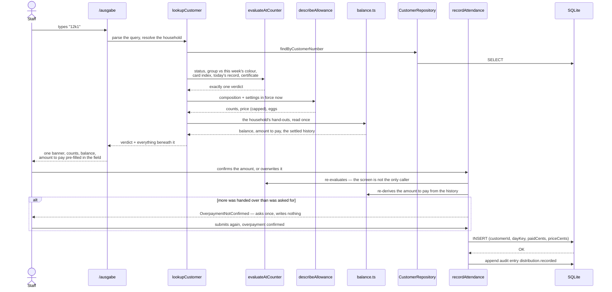
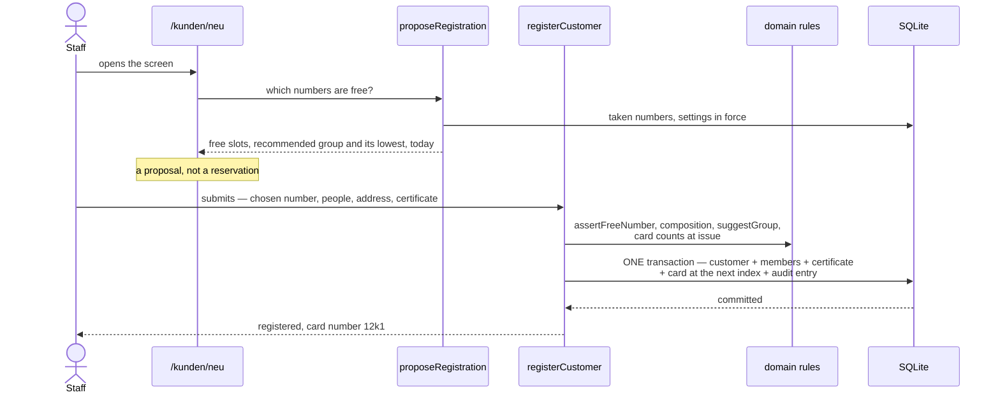
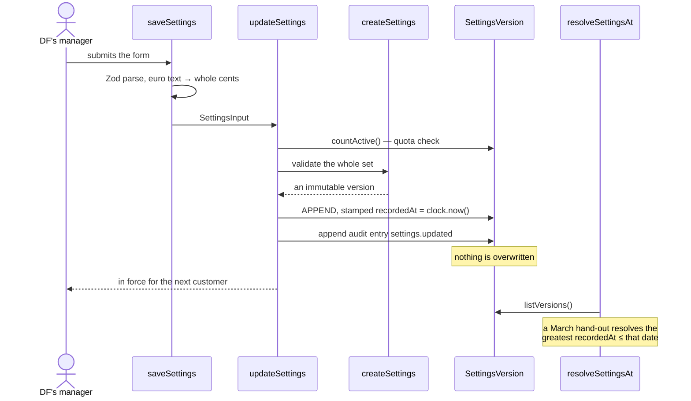
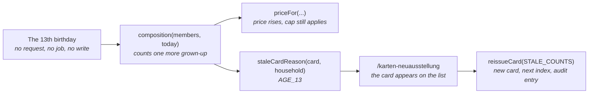

# 6. Runtime view

_Last reviewed: 2026-09-02_

Four scenarios, chosen for what they reveal rather than for how easily they draw. Participants are
named as in [chapter 5](05-building-block-view.md). The failure paths are the point — they are where
the architecture actually lives.

## Scenario 1 — serving a household at the counter

**Intention:** a staff member has a card number in front of them and must answer one question: may
this household collect today, and what do they hand over?

**What it shows.** The verdict is produced in one pure function with a fixed precedence chain, not
assembled from conditions in JSX. Its `statementFor` ends in a `never`-typed default branch, so a
ninth verdict is a compile error until the counter renders it — no answer can ever be a blank banner.
The price stored on the record is the same one the staff member saw, because both come from
`describeAllowance` reading the clock once.

**Money is an amount, not a flag.** The counter does not ask whether the household paid; it shows
what they owe — the week's price offset by their balance — and collects the amount actually handed
over. Both the balance and the amount to pay are derived from the hand-outs the use case has already
loaded ([ADR-015](adr/015-derive-the-customer-balance-from-the-hand-out-history-never-store-it.md)),
so the counter issues no second query for them. The field arrives pre-filled with the amount to pay
and is normally just confirmed; a staff member may overwrite it with less (a part payment) or with
more (paying ahead), and what is stored is what was handed over.

**Key exception — more than was asked for.** `recordAttendance` re-derives the amount to pay from the
history rather than trusting the figure the screen showed, and refuses a larger payment with
`OverpaymentNotConfirmed` — **writing nothing**. The staff member is asked once and submits again
with the confirmation, which is how a mistyped 50,00 € is caught while it is still only a number in a
field. `correctAttendance` guards the same way against the amount that was asked for that day, and
both may only touch a record made **today**: a mistake found later is put right by a compensating
amount at the household's next hand-out, which the balance absorbs by construction.

**Key exception — already served today.** `canRecord` refuses a second hand-out on the same
_Europe/Berlin_ calendar day and nothing is written. If two requests race past that guard, the
`@@unique([customerId, dayKey])` index refuses the second, and the adapter turns Prisma's `P2002`
into `AlreadyServedToday`. The guard is convenience; **the constraint is the rule**.

**Other exceptions.** An `ARCHIVED`, `BLOCKED` or `WRONG_GROUP` household is refused with
`NotClearToServe` — re-checked inside the use case, because the counter screen is not its only
caller. An expired certificate does **not** refuse: it serves, and offers to log a reminder.

## Scenario 2 — registering a customer

**Intention:** put a new household on the register, on a number the staff member picks.

**What it shows.** The free-number list is a _proposal_, never a reservation — nothing is held
between reading it and writing the row. The whole registration is one transaction, so a household
never exists without its first card or its audit entry. `registerCustomer` is also the only
registration path: re-registering an archived household and promoting from the waiting list both
route through it, because a second path would give the number allocation, the group balancing, the
first card and the audit entry two homes, and only one would be fixed the day a rule changed.

**Key exception — the number was taken while the form was open.** The partial unique index over
non-archived rows refuses the insert and the adapter raises `CustomerNumberTaken`. Since staff choose
the number themselves (US-24), this **is not retried** onto the next free slot: a number a person
chose has no substitute, so the refusal goes back to the screen with the pool re-read. When the rule
picked the number, a silent retry was defensible; now it is not.

## Scenario 3 — saving a settings change

**Intention:** DF raises the price per grown-up, and last March's distributions must still price
correctly.

**What it shows.** Policy is versioned data, not constants, and a save takes effect immediately —
there is no staff-entered "effective from" date, because dating a change was a field to get wrong
rather than a requirement. Euro text becomes whole cents in the action, before anything leaves it.
Rows read back out of the database go through `createSettings` again, so a hand-edited file cannot
smuggle an invalid policy in.

**Key exception — the quota is lowered below the number of active households.** `updateSettings`
refuses with `QuotaBelowActiveCustomers` and nothing is appended; the screen names the current count.

**A note on races.** `recordedAt` is indexed and deliberately _not_ unique. Two saves in the same
millisecond are a concurrency accident, not a business error, and the later row wins by position.
Acceptable at this many users.

## Scenario 4 — a birthday moves a child to grown-up

**Intention:** show what happens on the day a child in a registered household turns 13.

**What it shows.** **Nothing runs.** No scheduled job, no trigger, no migration of stored counts —
the derivation simply starts answering differently, everywhere at once, because no count was ever
stored. This is the scenario that makes
[derive-don't-store](adr/007-derive-anything-computable-rather-than-storing-it.md) architecture
rather than style: with typed-in counts, this day requires a process that runs on a machine which is
switched off six days a week.

**What does _not_ move is the egg allowance.** Its rule counts heads of any age, so the household is
the same size the day after the birthday as the day before — the counts and the price move, the eggs
stay ([ADR-014](adr/014-store-the-egg-allowance-as-versioned-threshold-rows.md)).

The printed card is the one thing that _cannot_ update itself, which is exactly why
`grownUpsAtIssue` and `childrenAtIssue` are stored: without a snapshot of what the physical card
says, there is nothing to compare today's household against, and the reissue list could not exist.
Those columns are never updated in place — **the reissue is how the change is recorded.** The card's
**week** needs no third column: it is the parity of the slot the card was printed under
([ADR-017](adr/017-the-customer-number-decides-the-group.md)), and a card therefore never falls stale
for its week.

**Key exception — the household never comes back.** The card stays on the reissue list indefinitely,
and that is correct: the list is a prompt for staff, not a queue the system drains. There is no
threshold and no automatic action, here or anywhere else.

**Cost.** The comparison has a rule over birthdates on one side, so it cannot be a `WHERE` clause.
The list reads the whole register — accepted at a few hundred rows, and documented rather than worked
around.

---

Previous: [5. Building block view](05-building-block-view.md) · Next: [7. Deployment view](07-deployment-view.md)
