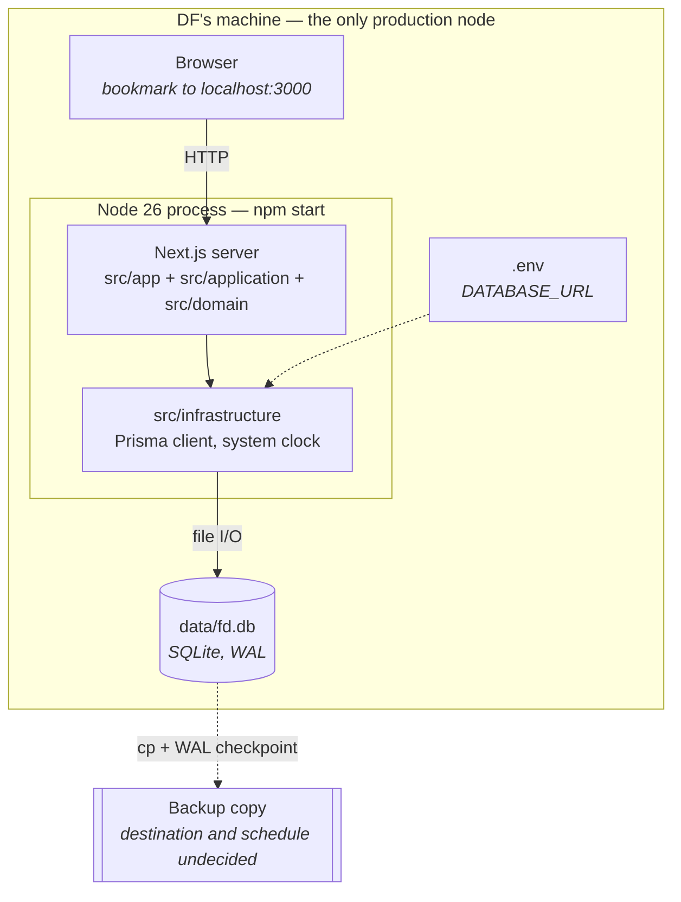

# 7. Deployment view

_Last reviewed: 2026-08-08_

There is one production node and it is a laptop. That is the design, not a stage on the way to
something else — see [ADR-002](adr/002-store-the-register-in-a-single-sqlite-file.md) and
[ADR-003](adr/003-ship-without-login-and-bind-the-application-to-localhost.md).

## Production

**No listener beyond localhost. No inbound port. No scheduled process. No outbound request.** The
application makes no network call at runtime — the font is self-hosted so that a day without internet
is an ordinary day.

| Building block                                                   | Node                    | Notes                                                      |
| ---------------------------------------------------------------- | ----------------------- | ---------------------------------------------------------- |
| `src/app`, `src/application`, `src/domain`, `src/infrastructure` | The single Node process | One deployable; there is nothing to distribute             |
| `data/fd.db`                                                     | The same machine's disk | The entire state of the system, and the entire backup unit |

## Environments

| Environment                    | How it starts                                     | Database                                                                   | Clock                                  |
| ------------------------------ | ------------------------------------------------- | -------------------------------------------------------------------------- | -------------------------------------- |
| **DF's machine** (production)  | `npm run build && npm start`                      | `data/fd.db`, persistent                                                   | The wall clock                         |
| **Local development**          | `npm run dev`                                     | `data/fd.db`, reset with `npm run db:reset`, seeded with `npm run db:demo` | The wall clock                         |
| **CI — e2e, default project**  | Playwright starts a built server on **port 3000** | `data/e2e.db`, deleted and re-migrated per run                             | Pinned via `data/e2e-now.txt`          |
| **CI — e2e, isolated project** | A second built server on **port 3001**            | `data/e2e-isolated.db`, empty                                              | Pinned via `data/e2e-isolated-now.txt` |

The second e2e server exists for one reason: the waiting-list spec has to make the register _full_,
and the quota may not fall below the active customer count — so on a shared database holding
customers on numbers in the hundreds, no quota could ever leave it full.

## Configuration

Values are never documented here — only that a setting exists, where it is set, and what breaks
without it.

| Setting             | Where set                                                                  | Default                                               | Required | Effect                                                                                                                                                                                                                                                                                                                                                                            |
| ------------------- | -------------------------------------------------------------------------- | ----------------------------------------------------- | -------- | --------------------------------------------------------------------------------------------------------------------------------------------------------------------------------------------------------------------------------------------------------------------------------------------------------------------------------------------------------------------------------- |
| `DATABASE_URL`      | `.env` (copied from `.env.example`); overridden per job in CI              | `file:../data/fd.db`                                  | **Yes**  | Which SQLite file is the register. ⚠️ Prisma resolves a relative `file:` path **relative to `prisma/schema.prisma`**, which is why it starts `../data/`. The Prisma CLI and the generated client resolve it from different working directories — a known footgun                                                                                                                  |
| `FD_FIXED_NOW_FILE` | Playwright `webServer.env` only                                            | unset                                                 | No       | Names a file holding an ISO instant that `systemClock` returns instead of the wall clock. Read from the environment **once at module load**, so a running deployment cannot acquire a fixed clock; the file itself is re-read on every call, so a spec can move "today" between distribution weeks without restarting the server. Unreadable content falls back to the wall clock |
| `NODE_ENV`          | Set by the npm scripts                                                     | `development` locally, `production` under `npm start` | No       | Outside production the Prisma client is cached on `globalThis`, so hot reload does not exhaust the connection pool                                                                                                                                                                                                                                                                |
| Node version        | `.nvmrc`, `engines` in `package.json`, and the devcontainer's Node feature | 26                                                    | **Yes**  | CI reads `node-version-file: .nvmrc`; the app is not tested on anything else. The devcontainer pin is the one CI cannot see, so it has to be moved by hand — see [ADR-011](adr/011-track-the-newest-even-numbered-node-release.md)                                                                                                                                                |

No secret exists in this system: there is no credential, no API key and no token, because there is no
service to authenticate to.

## Operations

| Task                     | Command / procedure                             | Notes                                                                                                                                                                                                                                                                                |
| ------------------------ | ----------------------------------------------- | ------------------------------------------------------------------------------------------------------------------------------------------------------------------------------------------------------------------------------------------------------------------------------------ |
| Install or update        | `npm run setup`                                 | Dependencies, `.env`, client, migrations and seed in the one order that works — `prisma generate` must follow `.env` or the client cannot resolve `DATABASE_URL`. Idempotent, and never overwrites an existing `.env` or seeds over existing settings                                |
| Start                    | `npm run build && npm start`                    | Bookmarked at `http://localhost:3000`                                                                                                                                                                                                                                                |
| Apply migrations         | `npx prisma migrate deploy`                     | Run after every update; `npm run setup` already includes it                                                                                                                                                                                                                          |
| Seed policy values       | `npm run db:seed`                               | Idempotent; writes no audit entry. Provisional values: quota 240, 2 portions per grown-up and 1 per child, €2.00 and €1.00 per head, a €5.00 cap, Thursday, anchored at `2026-W02` RED. DF overwrite them on `/einstellungen`; the seeded quota is **not** DF's real one (see below) |
| Reset the local database | `npm run db:reset`                              | Deletes `data/fd.db`, re-applies migrations, re-seeds. **Required after any migration-history rewrite** — the first symptom of skipping it is the settings screen reporting nothing is configured                                                                                    |
| Demo data                | `npm run db:demo`                               | 20 synthetic households written _through the real use cases_ with a wound clock, so the result is a database the application could have produced                                                                                                                                     |
| **Backup**               | Copy `data/fd.db` after a SQLite WAL checkpoint | The single most important operational task                                                                                                                                                                                                                                           |

> **TODO:** No backup schedule, destination or restore drill exists yet — who runs it, where the copy
> goes, and how often. This is the whole disaster-recovery story and is tracked as the top risk in
> [chapter 11](11-risks-and-technical-debt.md).

> **TODO:** DF's real customer quota. The seed's 240 is a placeholder and DF serves roughly 250
> households, so it is wrong in the direction that matters — `updateSettings` refuses a quota below
> the active count, so a fresh install seeded too low cannot take the register it is meant to hold.
> Confirm the number with DF and set the seed to it before go-live.

## Build pipeline

`.github/workflows/ci.yml`, on every push to `main` and every PR into it. Four jobs, all on
`ubuntu-latest`, all doing `npm ci` then `npx prisma generate`:

| Job                         | Gates                                                                                                      |
| --------------------------- | ---------------------------------------------------------------------------------------------------------- |
| `lint-and-typecheck`        | `npm run lint` (**including the architecture boundary rules**), `npm run typecheck`, `npx prisma validate` |
| `unit-tests`                | `npm run test:coverage` — the 100 % gate on `src/domain` and `src/application`                             |
| `build`                     | `npm run build`                                                                                            |
| `e2e-tests` (needs `build`) | Playwright against the built app on a fresh SQLite file; the report is uploaded as an artifact for 7 days  |

A workflow-level dummy `DATABASE_URL` exists only so `prisma validate` and `next build` can resolve
`env("DATABASE_URL")`. `codeql.yml` runs on the same triggers plus a weekly cron, and Dependabot is
configured. Locally, Husky runs lint-staged pre-commit and the unit suite pre-push.

## If DF ever outgrows one machine

The path is a provider change in `schema.prisma` from `sqlite` to `postgresql`, new migrations, and
TLS in front. The application and domain layers do not move, because they only ever see the ports.
That path would also reopen [ADR-003](adr/003-ship-without-login-and-bind-the-application-to-localhost.md):
a networked deployment needs authentication.

---

Previous: [6. Runtime view](06-runtime-view.md) · Next: [8. Cross-cutting concepts](08-crosscutting-concepts.md)
