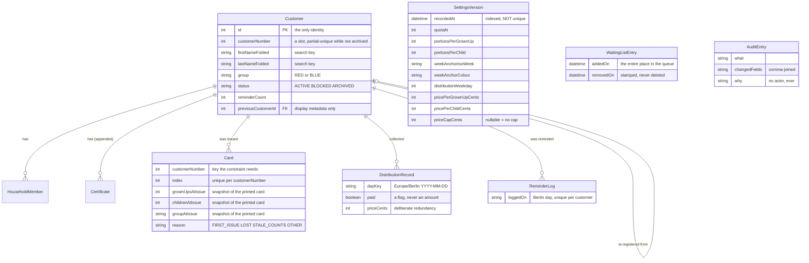

# 8. Cross-cutting concepts

_Last reviewed: 2026-08-07_

The rules that apply everywhere, so that five modules do not solve one problem five ways. Each says
what it is, why it exists, the rules that follow, and where it shows up. The "why did we choose this
over that" is [chapter 9](09-architectural-decisions.md); this chapter is "how do we do it".

## Domain model and persistence

Nine tables. The schema doubles as domain documentation and carries the argument for every unusual
decision in its comments.

`WaitingListEntry` and `AuditEntry` have **no relation to `Customer`** — deliberately. An applicant
is not a customer, and an audit entry outlives whatever it describes.

**The rules that follow:**

- Every foreign key targets `Customer.id`, never `customerNumber`. Confusing the two is the mistake
  the spreadsheet made — [ADR-008](adr/008-treat-a-customer-number-as-a-reusable-slot-not-an-identity.md).
- Nothing computable is stored, with four argued exceptions, each carrying its argument in the schema
  comments — [ADR-007](adr/007-derive-anything-computable-rather-than-storing-it.md). Do not "fix"
  them.
- No relation carries `onDelete: Cascade`, and a nullable relation says `onDelete: Restrict` out
  loud because Prisma's default there is `SetNull` —
  [ADR-010](adr/010-never-hard-delete-a-record-archive-and-let-the-database-refuse.md).
- A household's member rows are the one set that is _replaced_ rather than appended, because no
  history of past compositions is kept — what a household was survives on the card that printed its
  counts.
- Certificates are appended, never edited: a renewal stacks a row. The one on file is the latest by
  `recordedAt`, and the trail behind it says when each renewal was brought.

## Time

Time is the input most rules depend on and the one most likely to make a test lie, so it is a
dependency like any other.

- **One wall-clock read in the whole codebase**: `src/infrastructure/clock.ts`. Everything else takes
  a `Clock` port. A zero-argument `new Date()` or `Date.now()` is a lint error in `domain/` and
  `application/`; `new Date(someValue)` stays legal because it transforms a value that was passed in.
- **Two calendars, on purpose.** Attendance and reminders use the **Europe/Berlin** calendar day
  (`berlinDayKey`), because they turn on the local moment a person stood at the counter — including
  across both DST changes. Week colour, distribution day and birthdates use the **UTC** day, because
  a week's colour is a property of a configured week where the minute is irrelevant. Both derivations
  are named and shared; neither is re-implemented.
- **Named boundary tests.** A time-dependent rule is tested the day before, the day of and the day
  after, plus 29 February. `turns grown-up on the 13th birthday, not the day before` is the shape.
- The e2e suite cannot inject a fake, so the clock adapter carries the `FD_FIXED_NOW_FILE` seam —
  see [chapter 7](07-deployment-view.md#configuration).

## Configuration as data

Policy is `SettingsVersion` rows, not constants — [ADR-005](adr/005-keep-business-rules-as-dated-append-only-settings-data.md).

- Versions are **append-only** and stamped `recordedAt` from the clock. Nothing is overwritten and
  nothing is deleted.
- A saved change is **in force immediately**. There is no effective-from date to pick.
- Any rule needing a value resolves it with `resolveSettingsAt(instant)` — the greatest `recordedAt`
  not after that instant. `readCurrentSettings` is the single read seam.
- Rows re-enter the domain through `createSettings`, so a hand-edited database cannot bypass an
  invariant.
- **Nothing may hard-code a price, a portion count or a threshold.** And there are no thresholds to
  configure: reminders, no-shows and card losses are counted and never acted on, because what a count
  means is a staff judgement.
- `priceCapCents` is nullable rather than a `0` sentinel, because `0` is a coherent cap meaning every
  distribution is free — the two must stay distinguishable on the screen.

## Money

- **Integer cents, everywhere.** `Float` and `Decimal` appear nowhere in the schema; every price
  column is `Int`. SQLite has no decimal type and a float would round a price away.
- `src/domain/money.ts` owns the type and the German formatting. `formatEuroAmount` is hand-written
  rather than `Intl`, so output is deterministic across runtimes.
- Euro text becomes whole cents in the server action, before anything leaves it. `parseEuros` throws
  `InvalidEuroAmount`.
- A distribution record stores a `paid` **flag**, never an amount — plus `priceCents`, which is what
  the household owed under the policy in force that day.

## Errors and feedback

- Every failure is a **typed domain error** from `src/domain/errors.ts`, carrying the values that
  made it fail so the screen can name concrete numbers. No bare `throw new Error("…")`.
- `DomainErrorCode` is a **closed union**. `src/app/notice-tier.ts` maps it to a notice tier as an
  exhaustive `Record`, not a `switch` with a default, so a new code fails the build until somebody
  decides what it means.
- Three tiers: **success** (green), **refusal** (amber — the system worked and the answer is no) and
  **error** (red — something went wrong). The tier is decided from the _code_, never from the German
  sentence: a sentence is the thing most likely to be reworded, and a tier read back out of one
  changes when somebody fixes a comma.
- One screen shows **one answer at a time** — the last thing asked, nothing older — while leaving
  each notice beside the button that produced it (`notice-board.tsx`).

## Audit

Append-only entries recording _what_, _when_ and _why_ — **never who**, because there is no login to
tell its volunteers apart — [ADR-006](adr/006-record-what-when-and-why-in-the-audit-log-never-who.md).

- Required on every state change: archive, block, unblock, group move, card reissue, note edit,
  policy edit. Skipping one is a defect, not an omission.
- The _why_ is **mandatory** where the judgement is the record (block, archive) and optional where
  the changed fields already say it (a settings edit).
- `changedFields` is a comma-joined string because SQLite has no array type; it is only read back for
  display.

## Concurrency and consistency

At this many users the interesting concurrency is not load — it is two people doing the same thing at
once, and the answer is always the same: **the database settles it, not a read-then-write guard.**

| Invariant                                      | Constraint                                                                                |
| ---------------------------------------------- | ----------------------------------------------------------------------------------------- |
| One non-archived household per customer number | Partial unique index over `status <> 'ARCHIVED'`, hand-written — Prisma cannot express it |
| Exactly one valid card per household           | `@@unique([customerId, index])` — validity _is_ holding the highest index                 |
| A card number is never handed out twice        | `@@unique([customerNumber, index])`                                                       |
| One hand-out per household per Berlin day      | `@@unique([customerId, dayKey])`                                                          |
| One reminder per household per Berlin day      | `@@unique([customerId, loggedOn])`                                                        |

Each domain rule exists as well, because a use case that refuses early gives a better message. But
the constraint is the authority, and every adapter translates Prisma's `P2002` into the matching
typed error — `card-repository.ts` even works out _which_ of its two unique indexes fired by matching
the column list, because the two demand different recoveries.

Writes that must not half-happen are single transactions: a whole registration, a certificate renewal
with its reminder-count reset, a reminder entry with the incremented count.

## Internationalisation

- **Identifiers English, UI strings German**, and German only in `src/i18n/de.ts`. No German literal
  may appear in a component.
- `src/i18n/format.ts` holds the date and time formatting: `germanDate` formats in UTC (dates are
  days stored at midnight UTC), `germanTime` in Europe/Berlin (a hand-out is an instant). The split
  mirrors the two calendars above.

## Testing strategy

| Layer             | Approach                                                                         |
| ----------------- | -------------------------------------------------------------------------------- |
| `domain/`         | Strict TDD, red → green → refactor. The invariant-breaking test is written first |
| `application/`    | TDD against hand-written fakes. Fakes over mocking libraries                     |
| `infrastructure/` | Test-after, thin integration tests against a throwaway SQLite file               |
| `app/`            | Covered by Playwright. Logic here is a smell — push it down                      |

- **Coverage is gated at 100 % on `src/domain` and `src/application` only.** That number is a
  _consequence_ of TDD on pure logic, not a target — chased into UI and infrastructure it invites
  low-value tests. It is deliberately not collected there.
- One named test per business rule, named after the **rule** rather than the function.
- **Synthetic data only** (Faker). Never a real name, address or certificate in a fixture.
- Playwright exists because some things no unit test can see: a `"use server"` module exporting a
  non-function builds cleanly and fails at page load, and _an absence is not observable from within_
  — a spec that proves nothing was written snapshots the register either side of the read. It runs
  serially (`workers: 1`, `fullyParallel: false`) because a flaky gate is worth less than a slow one.
- The demo seed writes **through the real use cases**, never through Prisma, so the fixture cannot
  drift from the rules and cannot teach a maintainer that impossible states are possible.

## UI conventions

The UI standard is [`docs/ui_styling_guide.md`](../ui_styling_guide.md), and it stays there: it is a
standing rulebook for building screens rather than architecture documentation, and a second copy here
would recreate exactly the duplication that guide was consolidated to remove. What is architectural
about it:

- **Colour never carries meaning alone.** FD share one machine under variable hall lighting, so a
  colour-only distinction is one only some staff can make. A meaning gets one colour application-wide,
  registered once in `src/app/accents.ts`, and the word always accompanies the tint.
- **UI work is driven with the `playwright-cli` skill**, not only tested with it — the accessibility
  snapshot shows what the markup _means_ and a screenshot does not. This became a rule after a
  shadcn primitive swapped a semantic element for a `div` and passed both a green suite and a
  correct-looking screenshot.
- The root layout **reads no data**, because a fetch there would make every route in the application
  dynamic.

---

Previous: [7. Deployment view](07-deployment-view.md) · Next: [9. Architectural decisions](09-architectural-decisions.md)
